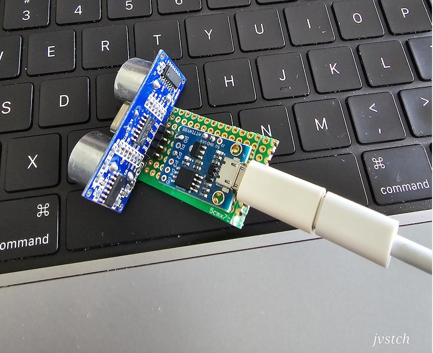

## pc-autolocker-hid-kb

A usb dongle project which emulates a keyboard and fires the lock shortcut as soon as move away from your PC. very useful for security sensitive environments.

### How to build this project?

1.  Install VSCodium in you Mac/Linux/PC(https://vscodium.com/)
2.  Launch VSCodium and Install the below extensions from VSIX file  
    a. ms-vscode.cpptools: (https://marketplace.visualstudio.com/items?itemName=ms-vscode.cpptools)  
    b. platformio: (https://marketplace.visualstudio.com/items?itemName=platformio.platformio-ide)
3.  Open this cloned repo folder in VScodium and click the Build/Flash button to build the project or flash the project to target.

### Hardware BoM:

1.  ATTINY85 based digistump or clones with Micronucleus bootloader (\<$5)
2.  HC-SR04 Ultrasound distance sensor
3.  An active buzzer 5v (optional: if you need audio feedback)
4.  An LED and a 220Ohm resistor (optional: if you need visual feedback)

### Schematic:

